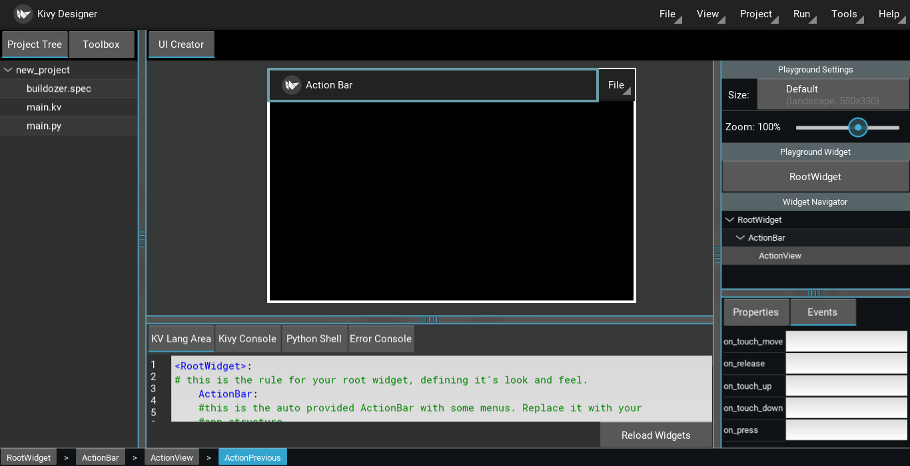

Kivy Studio Designer
=============

Kivy Studio Designer is Kivy's tool for designing graphical user interfaces
(GUIs) from Kivy Widgets. You can compose and customize widgets, and
test them. It is completely written in Python using Kivy.

Original project -> http://github.com/kivy/kivy-designer/

Prerequisites
-------------

- [Kivy](https://kivy.org/doc/stable/gettingstarted/installation.html)
- The following Python modules (available via pip):
    - [watchdog](https://pythonhosted.org/watchdog/)
    - [pygments](http://pygments.org/)
    - [docutils](http://docutils.sourceforge.net/)
    - [jedi](http://jedi.jedidjah.ch/en/latest/)
    - [gitpython](http://gitpython.readthedocs.org)
    - [six](https://pythonhosted.org/six/)

Installation
------------

To install the prerequisites, enter a console (on Windows use kivy.bat in the kivy folder):

    pip install -U watchdog pygments docutils jedi gitpython six

or simple run:

    pip install -Ur requirements.txt

With the prerequisites installed, you can use the designer:

    git clone https://github.com/SrGambiarra/KivyStudioDesigner/

or download it manually from https://github.com/SrGambiarra/KivyStudioDesigner/archive/refs/heads/main.zip

On OS X you might need to use the `kivy` command instead of `python` if you are using our portable package.

If you're successful, you'll see something like this:

License
-------

Kivy Studio Designer is released under the terms of the MIT License. Please refer to the
LICENSE file.

# xpopup
Usefull extensions of the `kivy.uix.popup.Popup` class.

Refactored copy of https://github.com/kivy-garden/garden.xpopup

Features
========

* `XPopup` - extension for the :class:`~kivy.uix.popup.Popup`. Implements methods
  for limiting minimum size of the popup and fit popup to the app's window.
  For more information, see `xpopup.py`.

* `XBase` - subclass of `XPopup`, the base class for all popup extensions.
  Supports an easy way to add a set of buttons to the popup. Use it to create
  your own popup extensions. For more information, see `xbase.py`.

* `XNotifyBase` - the base class for notifications. Implements the popup with a
  label. Use it to create your own notifications. For more information, see
  `notification.py`. Subclasses: 

    - `XNotification` - a popup that closes automatically after a time limit.

    - `XMessage`, `XError`, `XConfirmation` - templates for often used notifications.

    - `XProgress` - a popup with progress bar.
    
    - `XLoading` - a popup with a gif image.

* `XForm` - a simple basis for the UI-forms creation. For more information,
  see `form.py`. Subclasses:

    - `XSlider` - a popup with a slider.

    - `XTextInput` - a popup for editing singleline text.
    
    - `XNotes` - a popup for editing multiline text.

    - `XAuthorization` - a simple authorization form.

* `XFilePopup` - a popup for file system browsing. For more information,
  see `file.py`. Subclasses:

    - `XFileOpen` - a popup for selecting the files.
    
    - `XFileSave` - a popup for saving file. 
    
    - `XFolder` - a popup for selecting the folders.

* Just watch the video: https://youtu.be/UX8gCyEg2J8
